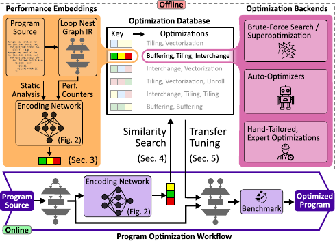

[](https://svgshare.com/i/Zhy.svg)

Daisy is a cloud-connected compiler pass providing *compiler optimizations as a service (COaaS)*.
Daisy *transfer tunes* optimizations available from databases using [performance embeddings](https://arxiv.org/abs/2303.08142). 
This repository provides tutorials demonstrating daisy for the supported platforms.



**Source:** [Performance Embeddings: A Similarity-based Approach to Automatic Performance Optimization](https://arxiv.org/abs/2303.08142)

## Installation

Daisy relies on tools for performance profiling and machine learning to match optimizations to programs. The following sections explain how to set up a conda virtual environment for Daisy.

**Step 1 (Profiling):** Modern hardware units provide interfaces to obtain statistics about the execution of a program, so-called *performance counters*. For instance, a CPU counts the number of executed instructions and branches. That information is read by Daisy using [LIKWID](https://github.com/RRZE-HPC/likwid) and the [Linux perf](https://perf.wiki.kernel.org/index.php/Main_Page) backend.

LIKWID can be installed in several ways, but we recommend installing it locally via conda:
```bash
conda install -c lukastruemper likwid
```
(Temporary Solution) We need to make the headers and libraries available:
```bash
export CPATH=$CONDA_PREFIX/include:$CPATH
export LIBRARY_PATH=$CONDA_PREFIX/lib:$LIBRARY_PATH
export LD_LIBRARY_PATH=$CONDA_PREFIX/lib:$LD_LIBRARY_PATH
```
Furthermore, to be able to read those counters, the *perf_event paranoid level* needs to be set to 0, which allows access to core (CPU) and uncore events (e.g., DRAM controller, I/O):
```bash
# Obtain the current value
cat /proc/sys/kernel/perf_event_paranoid
# Set the paranoid level temporarily
sudo sysctl -w kernel.perf_event_paranoid=0

# Set the paranoid level persistent
# sudo sh -c 'echo kernel.perf_event_paranoid=0 > /etc/sysctl.d/local.conf'
```
The perf_event paranoid level is a system-wide property. However, it is possible to only set those permissions per user and process through Linux capabilities. A detailed discussion of this topic is given in the documentation of [Intel VTune](https://www.intel.com/content/www/us/en/docs/vtune-profiler/cookbook/2023-0/profiling-hardware-without-sampling-drivers.html).

**Step 2 (PyTorch):** Daisy runs PyTorch to produce embeddings of your code and machine. PyTorch libraries can be installed easily via conda:

```bash
# PyTorch
conda install -c pytorch pytorch torchvision torchaudio cpuonly
# Additional libraries
conda install -c pyg pyg
conda install -c conda-forge pytorch-lightning torchmetrics
```

**Step 3 (Daisy):** Finally, the Daisy python package can be installed:
```bash
pip install daisytuner
```
and update to latest DaCe:
```bash
pip install git+https://github.com/spcl/dace.git
```
